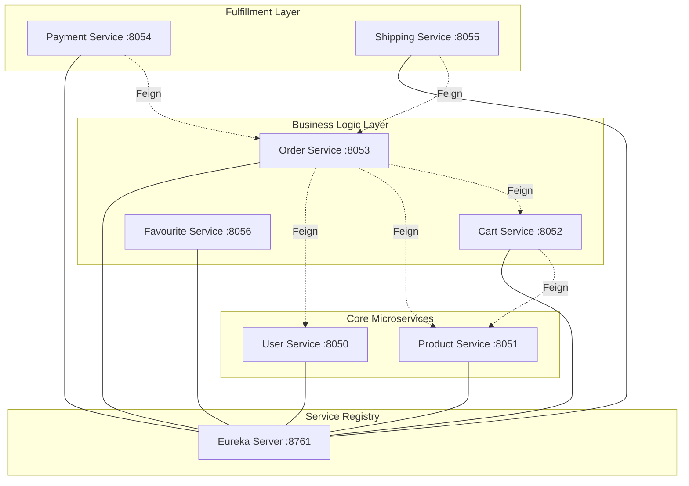

# 🛒 E-Commerce Microservices Ecosystem

A modern, highly-scalable distributed e-commerce application built with a **Cloud-Native** approach. This project showcases the implementation of a microservices architecture using the Netflix OSS stack for service discovery and Spring Cloud for seamless integration.

---

## 🏗️ System Architecture

This project follows the **Database-per-Service** pattern, ensuring each service is fully decoupled, independently deployable, and scalable.

---

## 🛠️ Technology Stack

| Category       | Tools & Technologies                                        |
| :------------- | :---------------------------------------------------------- |
| **Frameworks** | Spring Boot 3.x, Spring Data JPA, Spring Web                |
| **Cloud**      | Eureka (Discovery), OpenFeign (Communication), LoadBalancer |
| **Database**   | MySQL (8.x)                                                 |
| **Utilities**  | Lombok, MapStruct (DTO Mapping), SLF4J (Logging)            |
| **Build Tool** | Maven                                                       |

---

## 📡 Service Catalog

| Service               | Port   | Database          | Primary Responsibility                   |
| :-------------------- | :----- | :---------------- | :--------------------------------------- |
| **Eureka Server**     | `8761` | N/A               | Centralized Service Registry & Discovery |
| **User Service**      | `8050` | `ecomuserms`      | Identity management & Role-based access  |
| **Product Service**   | `8051` | `ecomproductms`   | Global product catalog & Stock control   |
| **Cart Service**      | `8052` | `ecomcartms`      | Persistent shopping sessions per user    |
| **Order Service**     | `8053` | `ecomorderms`     | Checkout orchestration & Flow management |
| **Payment Service**   | `8054` | `ecompaymentms`   | Secure transaction processing            |
| **Shipping Service**  | `8055` | `ecomshippingms`  | Logistic tracking & delivery scheduling  |
| **Favourite Service** | `8056` | `ecomfavouritems` | User-specific product wishlists          |

---

## 🏁 Getting Started

### 1. Prerequisites

- **Java 17 Development Kit**
- **Maven 3.6+**
- **MySQL Server** (Running on port 3306)

### 2. Database Setup

Ensure MySQL is running. Configuration is set to `createDatabaseIfNotExist=true`, so schemas will be created automatically upon service startup if credentials are correct (`root/root`).

### 3. Startup Order (Priority)

To avoid registration delays, follow this sequence:

1.  **Eureka Server** (Wait for Dashboard at http://localhost:8761)
2.  **User & Product Services** (Critical data providers)
3.  **Cart & Order Services**
4.  **Payment & Shipping Services**

---

## 🧪 Testing End-to-End Flow

For step-by-step API documentation and full JSON payloads, refer to the [**TESTING_ENDPOINTS.txt**](./TESTING_ENDPOINTS.txt) guide.

### The Checkout Workflow:

1. **Identity**: Create a user with credentials.
2. **Catalog**: Populate products with price and stock.
3. **Session**: Add items to the cart for a specific user ID.
4. **Checkout**: Trigger the Order service (it will pull data from Cart/Product/User).
5. **Finalize**: Process Payment and initiate Shipping.

---

## 🛡️ Key Architectural Patterns

- **Service Discovery**: Automatic detection of service instances without hardcoded URLs.
- **Declarative REST**: Using Feign interfaces to call other services as if they were local methods.
- **Data Integrity**: Bidirectional JPA mappings and transactional consistency.
- **Validation**: Strict entry validation using `jakarta.validation`.

---

## 🚀 Future Roadmap

- [ ] Implement **Spring Cloud Gateway** for a single entry point.
- [ ] Add **Resilience4j** Circuit Breakers for fault tolerance.
- [ ] Centralize configuration using **Spring Cloud Config Server**.
- [ ] Implement **Distributed Tracing** with Micrometer & Zipkin.

---

Developed by **Harish Nampally**
