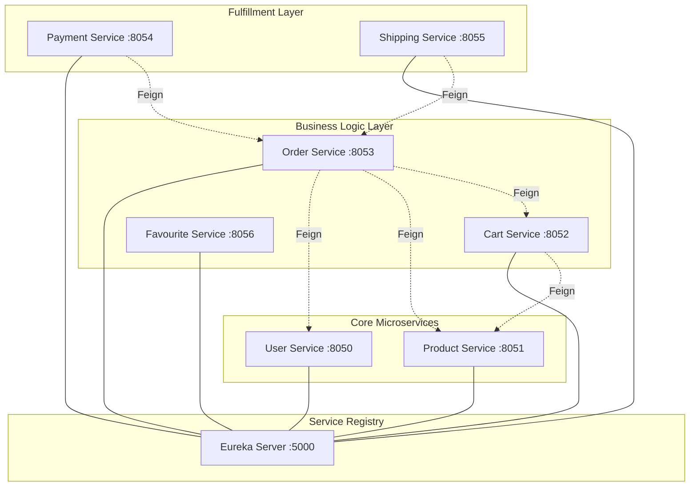

# 🛒 E-Commerce Microservices Ecosystem

[](https://www.oracle.com/java/)
[](https://spring.io/projects/spring-boot)
[](https://spring.io/projects/spring-cloud)
[](https://www.mysql.com/)

A modern, highly-scalable distributed e-commerce application built with a **Cloud-Native** approach. This project showcases the implementation of a microservices architecture using the Netflix OSS stack for service discovery and Spring Cloud for seamless integration.

---

## 🏗️ System Architecture

This project follows the **Database-per-Service** pattern, ensuring each service is fully decoupled, independently deployable, and scalable.


```mermaid
graph TD
    subgraph "Service Registry"
        Eureka[Eureka Server :5000]
    end

    subgraph "Core Microservices"
        User[User Service :8050]
        Product[Product Service :8051]
    end

    subgraph "Business Logic Layer"
        Cart[Cart Service :8052]
        Favourite[Favourite Service :8056]
        Order[Order Service :8053]
    end

    subgraph "Fulfillment Layer"
        Payment[Payment Service :8054]
        Shipping[Shipping Service :8055]
    end

    User --- Eureka
    Product --- Eureka
    Cart --- Eureka
    Order --- Eureka
    Payment --- Eureka
    Shipping --- Eureka
    Favourite --- Eureka

    Order -.->|Feign| User
    Order -.->|Feign| Product
    Order -.->|Feign| Cart
    Payment -.->|Feign| Order
    Shipping -.->|Feign| Order
    Cart -.->|Feign| Product
```

---

## 🛠️ Technology Stack

| Category       | Tools & Technologies                                        |
| :------------- | :---------------------------------------------------------- |
| **Frameworks** | Spring Boot 3.x, Spring Data JPA, Spring Web                |
| **Cloud**      | Eureka (Discovery), OpenFeign (Communication), LoadBalancer |
| **Database**   | AWS RDS MySQL (8.x)                                         |
| **Utilities**  | Lombok, MapStruct (DTO Mapping), SLF4J (Logging)            |
| **Build Tool** | Maven                                                       |

---

## 📡 Service Catalog

| Service               | Port   | Database          | Primary Responsibility                   |
| :-------------------- | :----- | :---------------- | :--------------------------------------- |
| **Eureka Server**     | `5000` | N/A               | Centralized Service Registry & Discovery |
| **Config Server**     | `8888` | N/A               | Centralized Application Configuration    |
| **User Service**      | `8050` | `ecomuserms`      | Identity management & Role-based access  |
| **Product Service**   | `8051` | `ecomproductms`   | Global product catalog & Stock control   |
| **Cart Service**      | `8052` | `ecomcartms`      | Persistent shopping sessions per user    |
| **Order Service**     | `8053` | `ecomorderms`     | Checkout orchestration & Flow management |
| **Payment Service**   | `8054` | `ecompaymentms`   | Secure transaction processing            |
| **Shipping Service**  | `8055` | `ecomshippingms`  | Logistic tracking & delivery scheduling  |
| **Favourite Service** | `8056` | `ecomfavouritems` | User-specific product wishlists          |

---

## 🏁 Getting Started

### 1. Prerequisites

- **Docker** and **Docker Compose**
- **AWS RDS** (MySQL 8.x Instance) or local MySQL

### 2. Database Setup

1. Create a `.env` file in the root directory.
2. Add your AWS RDS or MySQL database credentials to it:
   ```env
   DB_HOST=your-database-endpoint.rds.amazonaws.com
   DB_NAME=ecomdb
   DB_USER=admin
   DB_PASS=your_password
   ```

### 3. Running with Docker Compose

Since there are 10 total microservices, they should be started in a staggered order to prevent overwhelming the server's CPU and database connection pool.

```bash
# 1. Start the Configuration and Registry Servers first
docker compose up -d eureka-server config-server

# wait ~30 seconds for them to boot

# 2. Start the core data providers
docker compose up -d user-service product-service

# wait ~30 seconds

# 3. Start the downstream dependents
docker compose up -d cart-service inventory-service order-service payment-service shipping-service favourite-service
```

> **Note:** The Eureka Dashboard will be accessible at `http://localhost:5000` (or your EC2 IP).

---

## 🧪 Testing End-to-End Flow

For step-by-step API documentation and full JSON payloads, refer to the [**TESTING_ENDPOINTS.txt**](./TESTING_ENDPOINTS.txt) guide.

### The Checkout Workflow:

1. **Identity**: Create a user with credentials.
2. **Catalog**: Populate products with price and stock.
3. **Session**: Add items to the cart for a specific user ID.
4. **Checkout**: Trigger the Order service (it will pull data from Cart/Product/User).
5. **Finalize**: Process Payment and initiate Shipping.

---

## 🛡️ Key Architectural Patterns

- **Service Discovery**: Automatic detection of service instances without hardcoded URLs.
- **Declarative REST**: Using Feign interfaces to call other services as if they were local methods.
- **Data Integrity**: Bidirectional JPA mappings and transactional consistency.
- **Validation**: Strict entry validation using `jakarta.validation`.

---

## 🚀 Future Roadmap

- [ ] Implement **Spring Cloud Gateway** for a single entry point.
- [ ] Add **Resilience4j** Circuit Breakers for fault tolerance.
- [x] Centralize configuration using **Spring Cloud Config Server**.
- [ ] Implement **Distributed Tracing** with Micrometer & Zipkin.

---

Developed by **Harish Nampally**
